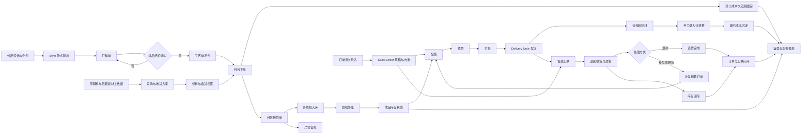
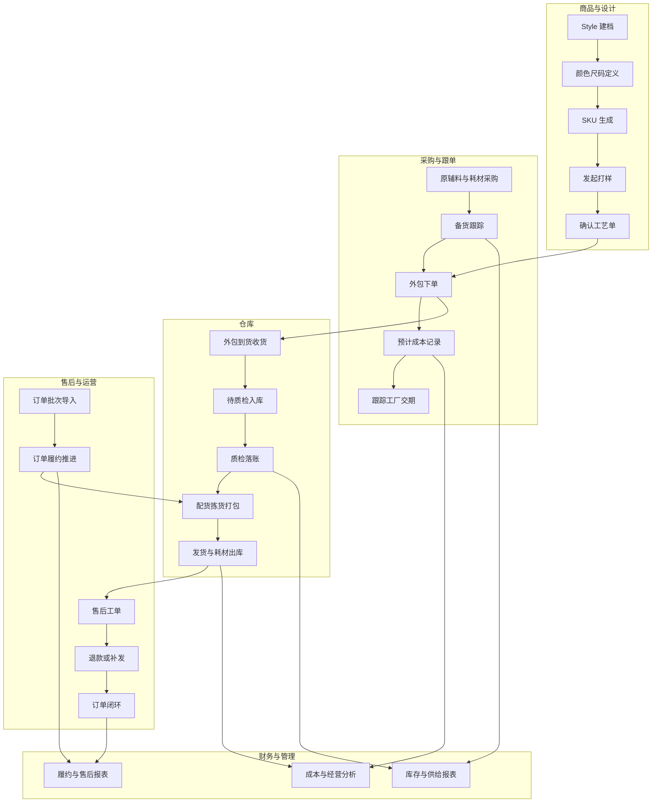
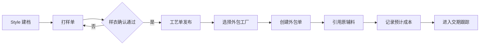
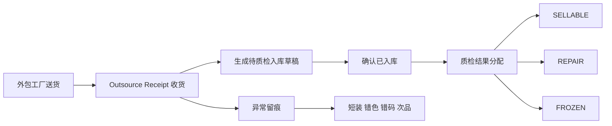
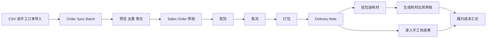
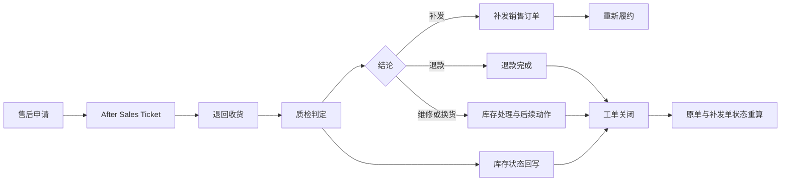
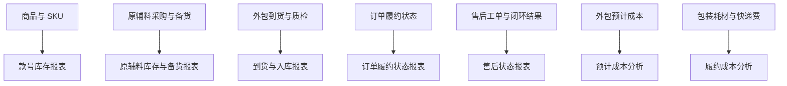

# Fashion ERP 业务导向工作流程图

本文档按“业务结果倒推业务动作”的方式，整理 `fashion_erp` 当前阶段的主流程，作为后续 `T450 / T451 / T490` 报表设计和业务验收的参考基线。

## 1. 业务边界

- ERP 正式起点是 `Style` 款式建档，不承接季度企划和设计主题讨论
- 大货主线来自 `第三方外包工厂`，不是内部完整生产
- 平台订单、发货状态、售后状态的自动同步当前统一按 `外部依赖阻塞/暂停` 处理，现阶段只保留手工入口
- 外包下单与原辅料出库 `不自动联动`，只要求引用关系可追踪
- 履约成本当前口径为 `包装耗材估算金额 + 手工快递费`
- 后续报表应围绕 `库存 / 供给 / 到货 / 履约 / 售后 / 成本` 六类经营事实展开

## 2. 业务主线总览

### 2.1 当前开发进度总览

| 环节 | 当前状态 | 当前落地情况 | 备注 |
|---|---|---|---|
| 外部设计与企划 | `业务外部承接` | 仓库内没有对应 `DocType / service` | 与业务边界一致，不进入本 ERP |
| `Style / 颜色 / 尺码 / SKU` | `已完成基础版` | 已具备 `Style`、颜色尺码字典、模板货品、SKU 生成和矩阵查询 | 已可作为 ERP 正式起点 |
| 打样与工艺单 | `已完成基础版` | 已具备 `Sample Ticket / Craft Sheet`、状态流转、版本与日志 | 已能支撑外包下单依据 |
| 原辅料、包装耗材、采购收货 | `已完成基础版` | 已具备物料用途、供应商角色、采购/收货扩展字段和服务端校验 | 仍不做自动扣料 |
| 供料与备货视图 | `已完成基础版` | 已能基于 `Outsource Order.materials` 计算 `required / on_hand / on_order / to_purchase` | 当前是轻量视图，不是完整 `Supply Plan` |
| 外包下单、到货、质检 | `已完成基础版` | 已具备 `Outsource Order / Receipt`、状态流转、待检入库草稿、质检落账草稿、异常留痕 | 索赔和责任归属流程未做 |
| 手工订单同步 | `外部依赖阻塞/暂停` | 仓库内已具备 `Channel Store / Order Sync Batch`、CSV 粘贴导入、去重聚合、`Sales Order` 草稿创建的基础实现 | 因暂时没有抖音官方稳定数据来源结构，当前暂停继续投入，避免后续重改 |
| 仓储履约与履约成本 | `已完成基础版` | 已具备 `Sales Order` 履约状态、配货/拣货/打包动作、`Delivery Note` 耗材和快递费成本 | 当前“锁库存”是业务状态，不是真实 WMS 级预留 |
| 售后闭环 | `已完成基础版` | 已具备 `After Sales Ticket`、退款、补发直建、库存凭证直提和订单状态回刷 | 平台售后回写、自动退款对账为 `外部依赖阻塞/暂停`；独立维修工单闭环为下一步研发计划 |
| 辅助生产与内部生产跟踪 | `已完成基础版` | 已具备 `Production Ticket`、BOM/工单/库存草稿联动和 `Production Board` 看板 | 只做轻量生产跟踪，不进入完整 MES |
| 运营与财务报表 | `已完成基础版` | 已交付 `T450` 运营报表、`T451` 财务/成本报表和 Workspace 入口 | 当前仍缺更深的经营分析口径 |

补充说明：

- 本次按项目代码实际检查，主流程对应的 `DocType / service / hook / client script` 已基本齐备
- 同时执行了 `python3 -m unittest discover -s custom_apps/fashion_erp/tests/unit -p 'test_*.py'`，当前 `102` 项单元测试全部通过

## 3. 按角色的业务接力图

## 4. 关键业务子流程

### 4.1 商品开发到外包下单

业务重点：

- 工艺单是外包下单依据
- 原辅料先做引用追踪，不自动扣料
- 预计成本从外包单开始进入经营口径

开发进度：

- `Style 建档`：已完成基础版，`Style / Style Color / Color / Size System / Size Code / Item` 扩展、模板货品和 SKU 生成都已落地。
- `Style 主数据模型`：已按最新验收收口第一批，现已支持 `1-4` 级类目模板、`Season` 主数据、`Year` 主数据、`Fabric Master`，并把 `brand` 收紧为必填、把 `item_group` 明确为 `成品物料组`。
- `Style 尺码选择`：已完成基础版，现改为 `类目约束尺码体系 -> 选择本款实际尺码 -> 生成 SKU`，不再按整套体系全量生成。
- `Style 尺码防错`：已完成基础版，若款号已经生成 SKU，系统会锁定 `size_system` 与 `本款尺码`，避免后续改体系导致同码不同义。
- `Style 中文化`：已完成基础版，`Style Color` 等对象已补齐中文翻译，`Fabric Master` 中残留的 `MOQ` 也已改为中文标签 `起订量(MOQ)`。
- `Style 状态清洗`：已完成基础版，站点执行 `migrate` 后会把 `launch_status` 等历史英文值批量统一为中文，避免验收时继续出现中英混用。
- `打样单`：已完成基础版，支持新建、下发、开始打样、提交评审、返修、确认、取消和日志留痕。
- `样衣确认通过`：已完成基础版，工艺单发布前会强校验关联打样单必须处于 `已确认`。
- `工艺单发布`：已完成基础版，支持版本号、发布/作废、当前版本维护，以及从工艺单继续发起外包单。
- `选择外包工厂 / 创建外包单`：已完成基础版，外包单已支持供应商角色校验、状态流转、交期和预计成本字段。
- `引用原辅料`：已完成基础版，`Outsource Order.materials` 已能记录计划数、已备数、人工已发数、备货仓和库位。
- `记录预计成本`：已完成基础版，已支持 `unit_estimated_cost / total_estimated_cost`。
- `进入交期跟踪`：已完成基础版，已有 `expected_delivery_date`、外包状态和累计到货回写；但还没有独立催单和逾期报表。

### 4.2 到货入库与异常处理

业务重点：

- 成品不能直接跳过质检进入可售库存
- 异常先做轻量留痕，为后续对厂追责和分析留数据基础

开发进度：

- `Outsource Receipt 收货`：已完成基础版，支持到货登记、确认收货，并自动同步外包单上下文。
- `生成待质检入库草稿`：已完成基础版，已能生成 `Stock Entry(Material Receipt)` 草稿，把到货先落到 `QC_PENDING`。
- `确认已入库`：已完成基础版，到货单可绑定入库凭证并推进到 `已入库`。
- `质检结果分配`：已完成基础版，支持 `SELLABLE / REPAIR / DEFECTIVE / FROZEN` 数量分配与状态校验。
- `质检落账`：已完成基础版，已能生成最终落账草稿并确认 `已质检`。
- `异常留痕`：已完成基础版，已支持短装、错色、错码、次品汇总和异常摘要。
- `异常处理深度`：部分完成，目前仍是轻量留痕，尚未扩展为独立异常单、索赔、责任归属和赔付流程。

### 4.3 订单履约与履约成本

业务重点：

- 电商平台不接 API，因此订单导入批次就是业务入口
- 履约状态必须能从订单头和订单行两层观察
- 出货动作沉淀成本，不能只记录物流结果

开发进度：

- `CSV 或手工订单导入 / Order Sync Batch`：当前按 `外部依赖阻塞/暂停` 处理；仓库里已有标准模板、CSV 粘贴导入、`source_hash` 留痕和批次/行级统计的基础实现。
- `预览 / 去重 / 聚合`：当前按 `外部依赖阻塞/暂停` 处理；仓库里已具备按 `channel_store + external_order_id` 聚合和服务端预判重复的基础实现。
- `Sales Order 草稿`：当前按 `外部依赖阻塞/暂停` 处理；仓库里已具备自动创建销售订单草稿和补齐订单行冗余字段的基础实现。
- `配货 / 拣货 / 打包`：已完成基础版，已在 `Sales Order` 提供服务端动作和表单按钮；当前是履约状态推进，不是 WMS 级真实锁库。
- `Delivery Note 发货`：已完成基础版，可由销售订单生成发货单草稿，并在提交/取消时回刷订单头与订单行状态。
- `挂包装耗材 / 生成耗材出库草稿`：已完成基础版，支持限定包装耗材物料、自动估算金额，并生成 `Material Issue` 草稿。
- `录入手工快递费`：已完成基础版，`Delivery Note` 已补手工快递费字段并纳入履约总成本。
- `履约成本汇总`：已完成基础版，已提供按日期范围、公司汇总 `Delivery Note` 履约成本的服务端接口。
- `当前缺口`：订单同步相关后续能力当前统一按 `外部依赖阻塞/暂停` 处理；自动分仓仍未开始。

### 4.4 售后闭环

业务重点：

- 售后不是客服记录，而是订单、库存、补发动作的汇合点
- 补发单继续走正常履约主线，不做单独仓储旁路

开发进度：

- `After Sales Ticket`：已完成基础版，售后单号、订单/发货/明细关联、退货原因、处理结果和系统日志都已落地。
- `退回收货 / 质检判定`：已完成基础版，支持 `待退回 -> 已收货 -> 质检中 -> 待处理/待退款/待补发` 的状态流转。
- `退款完成`：已完成基础版，支持退款金额校验、退款确认和关单。
- `补发销售订单`：已完成基础版，当前可从售后单直接创建补发 `Sales Order` 草稿，自动回写补发履约状态；补发单完成后会自动关单，撤销/失效后会回退到 `待补发`。
- `库存状态回写`：已完成基础版，当前可从售后单直接提交 `Stock Entry` 做待检入库或最终处理，`Stock Entry` 提交/撤销后会自动回写售后单库存闭环状态和关联凭证。
- `原单与补发单状态重算`：已完成基础版，售后工单更新后会回刷原单与补发单的销售订单履约状态。
- `当前缺口`：平台售后回写、自动退款对账当前统一按 `外部依赖阻塞/暂停` 处理；`独立维修工单闭环` 已确定为下一步研发计划。

## 5. 报表沉淀图

说明：下面的进度同时覆盖“报表数据基础”和“正式报表交付状态”；当前 `T450 / T451` 都已交付基础版。

开发进度：

- `款号库存报表`：已完成基础版，已交付 `Style Inventory Overview`，可按款号、品牌、仓库查看成品 SKU 库存。
- `原辅料库存与备货报表`：已完成基础版，已交付 `Material Supply Overview`，可按外包单查看供料、在途和待采购。
- `到货与入库报表`：已完成基础版，已交付 `Outsource Receipt Overview`，可查看到货、异常、入库和质检状态。
- `订单履约状态报表`：已完成基础版，已交付 `Sales Fulfillment Overview`，可查看订单履约状态、待发货数量和售后关联。
- `售后状态报表`：已完成基础版，已交付 `After Sales Overview`，可查看售后状态、退款状态和补发关联。
- `预计成本分析`：已完成基础版，已交付 `Outsource Estimated Cost Analysis`，可查看外包预计成本、到货进度、未到货估算成本和逾期情况。
- `采购成本分析`：已完成基础版，已交付 `Material Procurement Cost Analysis`，可查看采购金额、已收货估算金额、未收货金额和外包备货关联。
- `履约成本分析`：已完成基础版，已交付 `Fulfillment Cost Analysis`，可查看耗材金额、手工快递费、履约总成本和单件履约成本。
- `内部生产看板`：已完成基础版，已交付 `Production Board`，可查看生产卡阶段分布、延期、最近阶段日志以及 BOM/工单/库存联动情况。

## 6. 对后续工作的直接指向

当前业务主线已经从“把流程打通”进入“把经营结果看清”阶段，本轮 `T450 / T451 / T490` 已完成基础交付，后续工作建议按下面顺序承接：

1. 先做站点 `migrate` 和业务验收
2. 再推进 `独立维修工单闭环`
3. 最后按真实车间场景决定是否继续扩内部生产

如果后续报表设计出现口径争议，应优先回到本文档确认三件事：

- 业务事实最早在哪个单据节点形成
- 哪个节点才是经营口径的最终确认点
- 哪些数据只是引用关系，哪些数据才是正式落账
